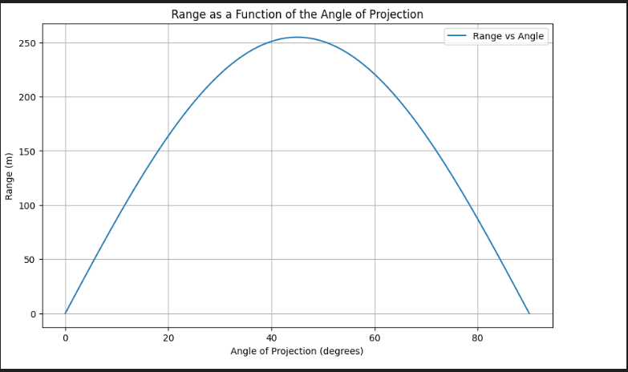

# Investigating the Range as a Function of the Angle of Projection

## 1. Theoretical Foundation

### Governing Equations of Motion

The motion of a projectile can be described using Newton's second law of motion. Assuming the only force acting on the projectile is gravity, the equations of motion in the horizontal (x) and vertical (y) directions are:

- **Horizontal Motion:**
  \[
  \frac{d^2x}{dt^2} = 0
  \]
  This implies that the horizontal velocity \( v_x \) is constant:
  \[
  v_x = v_0 \cos(\theta)
  \]
  where \( v_0 \) is the initial velocity and \( \theta \) is the angle of projection.

- **Vertical Motion:**
  \[
  \frac{d^2y}{dt^2} = -g
  \]
  This implies that the vertical velocity \( v_y \) changes with time:
  \[
  v_y = v_0 \sin(\theta) - gt
  \]
  where \( g \) is the acceleration due to gravity.

### General Solution

The position of the projectile as a function of time \( t \) can be derived by integrating the velocity equations:

- **Horizontal Position:**
  \[
  x(t) = v_0 \cos(\theta) \cdot t
  \]

- **Vertical Position:**
  \[
  y(t) = v_0 \sin(\theta) \cdot t - \frac{1}{2} g t^2
  \]

### Family of Solutions

The solutions form a family of parabolic trajectories, each corresponding to different initial conditions (e.g., \( v_0 \), \( \theta \), and \( g \)). The shape and range of the trajectory depend on these parameters.

---

## 2. Analysis of the Range

### Range as a Function of Angle

The range \( R \) of a projectile is the horizontal distance it travels before hitting the ground. For a projectile launched from and landing at the same height (\( y = 0 \)), the range is given by:
\[
R = \frac{v_0^2 \sin(2\theta)}{g}
\]

- The range is maximized when \( \theta = 45^\circ \), as \( \sin(2\theta) \) reaches its maximum value of 1.
- For angles \( \theta < 45^\circ \) or \( \theta > 45^\circ \), the range decreases symmetrically.

### Influence of Other Parameters

- **Initial Velocity (\( v_0 \))**: The range increases quadratically with \( v_0 \).
- **Gravitational Acceleration (\( g \))**: The range decreases inversely with \( g \).

---

## 3. Practical Applications

### Real-World Scenarios

- **Uneven Terrain:** If the projectile is launched from a height \( h \) above the landing point, the range equation becomes more complex and depends on \( h \).
- **Air Resistance:** Drag forces can significantly alter the trajectory, reducing the range and changing the optimal angle of projection.

---

## 4. Implementation

### Python Simulation

Below is a Python script to simulate projectile motion and visualize the range as a function of the angle of projection.

```python
import numpy as np
import matplotlib.pyplot as plt

# Constants
g = 9.81  # Gravitational acceleration (m/s^2)
v0 = 50   # Initial velocity (m/s)
angles = np.linspace(0, 90, 100)  # Angles from 0 to 90 degrees

# Range function
def calculate_range(v0, theta, g):
    theta_rad = np.radians(theta)
    return (v0**2 * np.sin(2 * theta_rad)) / g

# Calculate ranges
ranges = [calculate_range(v0, angle, g) for angle in angles]

# Plot
plt.figure(figsize=(10, 6))
plt.plot(angles, ranges, label="Range vs Angle")
plt.xlabel("Angle of Projection (degrees)")
plt.ylabel("Range (m)")
plt.title("Range as a Function of the Angle of Projection")
plt.grid()
plt.legend()
plt.show()
```

---

## 5. Discussion and Limitations

### Assumptions
- No air resistance.
- Constant gravitational acceleration.
- The launch and landing occur at the same height.

### Possible Improvements
- Incorporate air resistance for more realistic modeling.
- Consider varying gravity for high-altitude or space-based launches.
- Extend the model for launches from different heights.

This model provides a foundational understanding of projectile motion but must be refined for high-precision applications.
