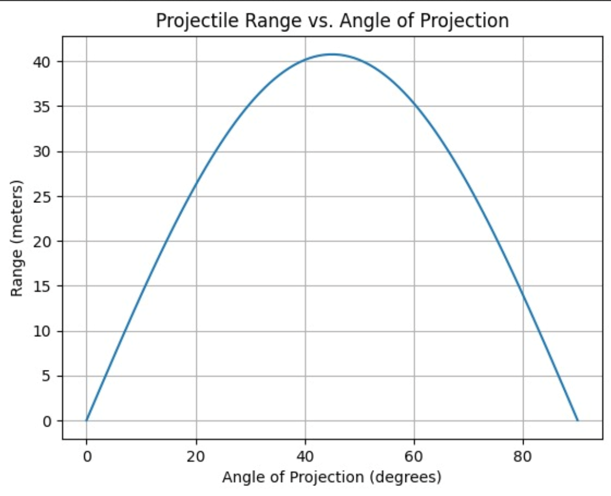

# Problem 1
# Investigating the Range as a Function of the Angle of Projection

## 1. Theoretical Foundation

### Governing Equations of Motion

The motion of a projectile can be described by the following differential equations derived from Newton's second law:

- **Horizontal Motion (x-direction):**
  \[
  \frac{d^2x}{dt^2} = 0
  \]
  This implies that the horizontal velocity \( v_x \) is constant:
  \[
  v_x = v_0 \cos(\theta)
  \]
  where \( v_0 \) is the initial velocity and \( \theta \) is the angle of projection.

- **Vertical Motion (y-direction):**
  \[
  \frac{d^2y}{dt^2} = -g
  \]
  where \( g \) is the acceleration due to gravity. The vertical velocity \( v_y \) is given by:
  \[
  v_y = v_0 \sin(\theta) - gt
  \]

The position of the projectile as a function of time \( t \) is:
\[
x(t) = v_0 \cos(\theta) \cdot t
\]
\[
y(t) = v_0 \sin(\theta) \cdot t - \frac{1}{2}gt^2
\]

### Family of Solutions

The solutions to these equations depend on the initial conditions:
- **Initial Velocity (\( v_0 \))**: Affects the magnitude of the velocity components.
- **Angle of Projection (\( \theta \))**: Determines the direction of the initial velocity.
- **Gravitational Acceleration (\( g \))**: Influences the vertical motion.

Varying these parameters leads to a family of parabolic trajectories.

## 2. Analysis of the Range

### Horizontal Range

The horizontal range \( R \) is the distance the projectile travels before hitting the ground. It can be derived by setting \( y(t) = 0 \) and solving for \( t \):
\[
0 = v_0 \sin(\theta) \cdot t - \frac{1}{2}gt^2
\]
\[
t = \frac{2v_0 \sin(\theta)}{g}
\]
Substituting this into the equation for \( x(t) \):
\[
R = v_0 \cos(\theta) \cdot \frac{2v_0 \sin(\theta)}{g} = \frac{v_0^2 \sin(2\theta)}{g}
\]

### Dependence on Parameters

- **Angle of Projection (\( \theta \))**: The range is maximized when \( \theta = 45^\circ \) because \( \sin(2\theta) \) reaches its maximum value of 1.
- **Initial Velocity (\( v_0 \))**: The range increases with the square of the initial velocity.
- **Gravitational Acceleration (\( g \))**: The range decreases as \( g \) increases.

## 3. Practical Applications

### Real-World Scenarios

- **Sports**: The trajectory of a soccer ball or a golf ball can be modeled using projectile motion.
- **Engineering**: The design of rockets and missiles involves understanding projectile motion.
- **Astrophysics**: The motion of celestial bodies can sometimes be approximated using projectile motion.

### Extensions

- **Uneven Terrain**: The model can be extended to account for varying launch and landing heights.
- **Air Resistance**: Incorporating drag forces can make the model more realistic.

## 4. Implementation

### Python Simulation

Below is a Python script to simulate projectile motion and visualize the range as a function of the angle of projection.

```python
import numpy as np
import matplotlib.pyplot as plt

# Constants
g = 9.81  # gravitational acceleration (m/s^2)
v0 = 30   # initial velocity (m/s)
angles = np.linspace(0, 90, 100)  # angles from 0 to 90 degrees

# Function to calculate range
def calculate_range(v0, theta, g):
    theta_rad = np.deg2rad(theta)
    return (v0**2 * np.sin(2 * theta_rad)) / g

# Calculate ranges
ranges = [calculate_range(v0, angle, g) for angle in angles]

# Plotting
plt.figure(figsize=(10, 6))
plt.plot(angles, ranges, label=f'v0 = {v0} m/s')
plt.xlabel('Angle of Projection (degrees)')
plt.ylabel('Range (m)')
plt.title('Range vs Angle of Projection')
plt.legend()
plt.grid(True)
plt.show()
