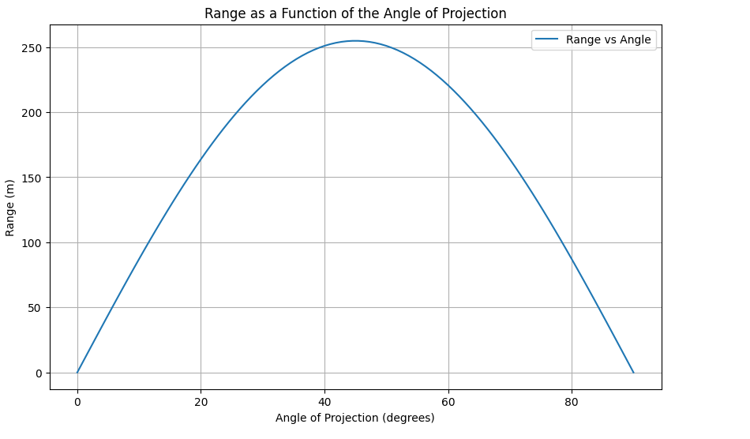

# Problem 1

## Investigating the Range as a Function of the Angle of Projection

### Motivation
Projectile motion, while seemingly simple, offers a rich playground for exploring fundamental principles of physics. The problem is straightforward: analyze how the range of a projectile depends on its angle of projection. Yet, beneath this simplicity lies a complex and versatile framework. The equations governing projectile motion involve both linear and quadratic relationships, making them accessible yet deeply insightful.

What makes this topic particularly compelling is the number of free parameters involved in these equations, such as initial velocity, gravitational acceleration, and launch height. These parameters give rise to a diverse set of solutions that can describe a wide array of real-world phenomena, from the arc of a soccer ball to the trajectory of a rocket.

## Task

### 1. Theoretical Foundation
- Derive the governing equations of motion from fundamental principles.
- Solve basic differential equations to establish the general form of the motion.
- Highlight how variations in initial conditions lead to a family of solutions.

### 2. Analysis of the Range
- Investigate how the horizontal range depends on the angle of projection.
- Discuss how changes in other parameters, such as initial velocity and gravitational acceleration, influence the relationship.

### 3. Practical Applications
- Reflect on how this model can be adapted to describe various real-world situations, such as projectiles launched on uneven terrain or in the presence of air resistance.

### 4. Implementation
- Develop a computational tool or algorithm to simulate projectile motion.
- Visualize the range as a function of the angle of projection for different sets of initial conditions.

## Deliverables
- A Markdown document with a Python script or notebook implementing the simulations.
- A detailed description of the family of solutions derived from the governing equations.
- Graphical representations of the range versus angle of projection, highlighting how different parameters influence the curve.
- A discussion on the limitations of the idealized model and suggestions for incorporating more realistic factors, such as drag or wind.

## Hints and Resources
- Start from the fundamental laws of motion and gradually build the general solution.
- Use numerical methods or simulation tools to explore scenarios that go beyond simple analytical solutions.
- Consider how this model connects to real-world systems, such as sports, engineering, and astrophysics.
## Python Implementation 
```python 
import numpy as np
import matplotlib.pyplot as plt
# Constants
g = 9.81  # Gravitational acceleration (m/s^2)
v0 = 50   # Initial velocity (m/s)
angles = np.linspace(0, 90, 100)  # Angles from 0 to 90 degrees

# Function to calculate range
def calculate_range(v0, theta, g):
    theta_rad = np.radians(theta)
    return (v0**2 * np.sin(2 * theta_rad)) / g

# Compute ranges
ranges = [calculate_range(v0, angle, g) for angle in angles]

# Plot range vs angle
plt.figure(figsize=(10, 6))
plt.plot(angles, ranges, label="Range vs Angle")
plt.xlabel("Angle of Projection (degrees)")
plt.ylabel("Range (m)")
plt.title("Range as a Function of the Angle of Projection")
plt.grid()
plt.legend()
plt.show()
```

## Discussion and Limitations

### Assumptions
- No air resistance.
- Constant gravitational acceleration.
- The launch and landing occur at the same height.

### Possible Improvements
- Incorporate air resistance for more realistic modeling.
- Consider varying gravity for high-altitude or space-based launches.
- Extend the model for launches from different heights.

This model provides a foundational understanding of projectile motion but must be refined for high-precision applications.

