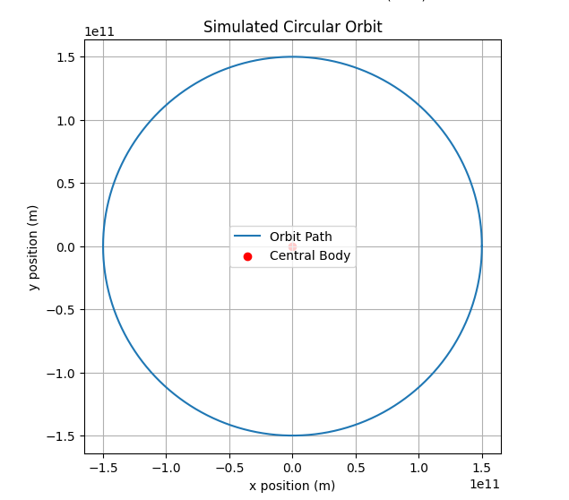
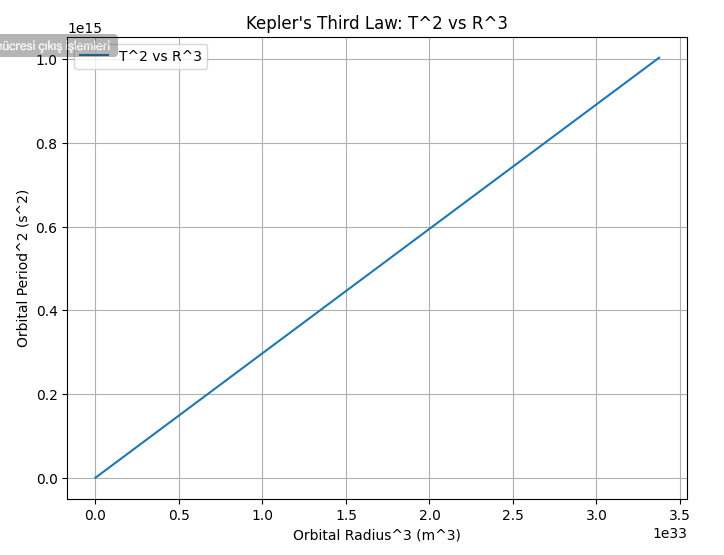

# Problem 1
## Orbital Period and Orbital Radius

### Motivation
The relationship between the square of the orbital period and the cube of the orbital radius, known as Kepler's Third Law, is a cornerstone of celestial mechanics. This simple yet profound relationship allows for the determination of planetary motions and has implications for understanding gravitational interactions on both local and cosmic scales. By analyzing this relationship, one can connect fundamental principles of gravity with real-world phenomena such as satellite orbits and planetary systems.

### Task
1. **Derive the Relationship**: Derive the relationship between the square of the orbital period and the cube of the orbital radius for circular orbits.
2. **Astronomical Implications**: Discuss the implications of this relationship for astronomy, including its role in calculating planetary masses and distances.
3. **Real-World Examples**: Analyze real-world examples, such as the Moon's orbit around Earth or the orbits of planets in the Solar System.
4. **Computational Model**: Implement a computational model to simulate circular orbits and verify the relationship.

### Derivation of Kepler's Third Law
For a small body orbiting a much larger body in a circular orbit, Newton's law of gravitation and centripetal force provide:
\[
F = \frac{G M m}{r^2} = m \frac{v^2}{r}
\]
where:
- \( G \) is the gravitational constant,
- \( M \) is the mass of the central body,
- \( m \) is the mass of the orbiting body,
- \( r \) is the orbital radius,
- \( v \) is the orbital velocity.

Since the orbital velocity is given by:
\[
v = \frac{2 \pi r}{T}
\]
substituting this into the force equation:
\[
\frac{G M}{r^2} = \frac{4 \pi^2 r}{T^2}
\]
Rearranging to express \( T^2 \) in terms of \( r^3 \):
\[
T^2 = \frac{4 \pi^2}{G M} r^3
\]
This confirms that the square of the orbital period \( T^2 \) is proportional to the cube of the orbital radius \( r^3 \), which is Kepler’s Third Law.

### Python Code for Simulation
```python
import numpy as np
import matplotlib.pyplot as plt

def orbital_period(radius, mass_central):
    """
    Calculate the orbital period using Kepler's Third Law.
    """
    G = 6.67430e-11  # Gravitational constant (m^3 kg^-1 s^-2)
    return 2 * np.pi * np.sqrt(radius**3 / (G * mass_central))

# Define constants
mass_earth = 5.972e24  # kg
mass_sun = 1.989e30  # kg
radii = np.linspace(1e7, 1.5e11, 100)  # Radius range (m)
periods = [orbital_period(r, mass_sun) for r in radii]

# Plot T^2 vs R^3
plt.figure(figsize=(8, 6))
plt.plot(radii**3, np.array(periods)**2, label='T^2 vs R^3')
plt.xlabel("Orbital Radius^3 (m^3)")
plt.ylabel("Orbital Period^2 (s^2)")
plt.title("Kepler's Third Law: T^2 vs R^3")
plt.legend()
plt.grid()
plt.show()

# Simulating a simple circular orbit
def simulate_orbit(radius, time_steps, mass_central):
    """
    Simulate a circular orbit around a central mass.
    """
    omega = np.sqrt(6.67430e-11 * mass_central / radius**3)  # Angular velocity
    times = np.linspace(0, 2 * np.pi / omega, time_steps)
    x = radius * np.cos(omega * times)
    y = radius * np.sin(omega * times)
    
    plt.figure(figsize=(6, 6))
    plt.plot(x, y, label='Orbit Path')
    plt.scatter(0, 0, color='red', label='Central Body')
    plt.xlabel("x position (m)")
    plt.ylabel("y position (m)")
    plt.title("Simulated Circular Orbit")
    plt.legend()
    plt.grid()
    plt.axis('equal')
    plt.show()

simulate_orbit(1.5e10, 1000, mass_sun)
```


### Discussion
1. **Astronomical Applications**:
   - Kepler's Third Law is used to determine planetary distances and masses.
   - It aids in calculating the orbits of exoplanets using observed transit periods.

2. **Extensions to Elliptical Orbits**:
   - The law generalizes to elliptical orbits with the semi-major axis \( a \) replacing \( r \).
   - This principle is foundational for understanding celestial mechanics.

This simulation and derivation provide a deeper understanding of Kepler’s Third Law and its significance in astrophysics.
