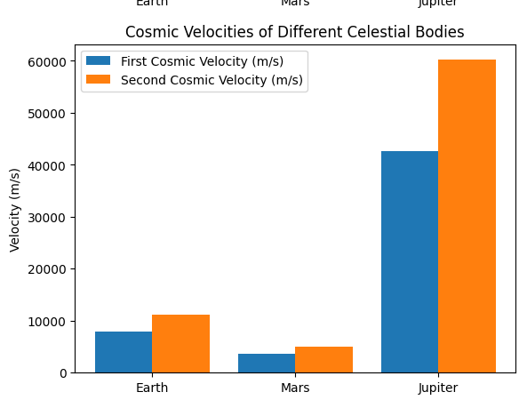

# Problem 2
### Escape Velocities and Cosmic Velocities

#### Motivation:
The concept of escape velocity is crucial for understanding the conditions required to leave a celestial body's gravitational influence. Extending this concept, the first, second, and third cosmic velocities define the thresholds for orbiting, escaping, and leaving a star system. These principles underpin modern space exploration, from launching satellites to interplanetary missions.

#### Task:
- Define the first, second, and third cosmic velocities, explaining their physical meaning.
- Analyze the mathematical derivations and parameters affecting these velocities.
- Calculate and visualize these velocities for different celestial bodies like Earth, Mars, and Jupiter.
- Discuss their importance in space exploration, including launching satellites, missions to other planets, and potential interstellar travel.

#### Deliverables:
- A Markdown document with a Python script or notebook implementing the simulations.
- A detailed explanation of the subjects.
- Graphical representations of escape velocities and cosmic velocities for various celestial bodies.

### Mathematical Formulation

The first cosmic velocity ($v_1$), or orbital velocity, is given by:
$$ v_1 = \sqrt{\frac{GM}{R}} $$

The second cosmic velocity ($v_2$), or escape velocity, is:
$$ v_2 = \sqrt{2} v_1 = \sqrt{\frac{2GM}{R}} $$

The third cosmic velocity ($v_3$), the velocity needed to leave the star system, is given by:
$$ v_3 = \sqrt{2 \frac{GM_{\text{sun}}}{d}} $$

Where:
- $G$ is the gravitational constant ($6.67430 \times 10^{-11} \ m^3 kg^{-1} s^{-2}$).
- $M$ is the mass of the celestial body.
- $R$ is the radius of the celestial body.
- $M_{\text{sun}}$ is the mass of the Sun.
- $d$ is the distance from the Sun.

### Python Code for Simulation

```python
import numpy as np
import matplotlib.pyplot as plt

def first_cosmic_velocity(mass, radius):
    G = 6.67430e-11  # Gravitational constant (m^3 kg^-1 s^-2)
    return np.sqrt(G * mass / radius)

def second_cosmic_velocity(mass, radius):
    return np.sqrt(2) * first_cosmic_velocity(mass, radius)

def third_cosmic_velocity(mass_sun, distance):
    return np.sqrt(2 * 6.67430e-11 * mass_sun / distance)

# Celestial bodies (mass in kg, radius in meters)
bodies = {
    "Earth": (5.972e24, 6.371e6),
    "Mars": (6.417e23, 3.3895e6),
    "Jupiter": (1.898e27, 6.9911e7),
}

# Compute velocities
velocities = {}
for body, (mass, radius) in bodies.items():
    v1 = first_cosmic_velocity(mass, radius)
    v2 = second_cosmic_velocity(mass, radius)
    velocities[body] = (v1, v2)

# Visualization
fig, ax = plt.subplots()
labels, v1_vals, v2_vals = zip(*[(k, v[0], v[1]) for k, v in velocities.items()])
x = np.arange(len(labels))

ax.bar(x - 0.2, v1_vals, 0.4, label="First Cosmic Velocity (m/s)")
ax.bar(x + 0.2, v2_vals, 0.4, label="Second Cosmic Velocity (m/s)")
ax.set_xticks(x)
ax.set_xticklabels(labels)
ax.set_ylabel("Velocity (m/s)")
ax.set_title("Cosmic Velocities of Different Celestial Bodies")
ax.legend()

plt.show()
```
