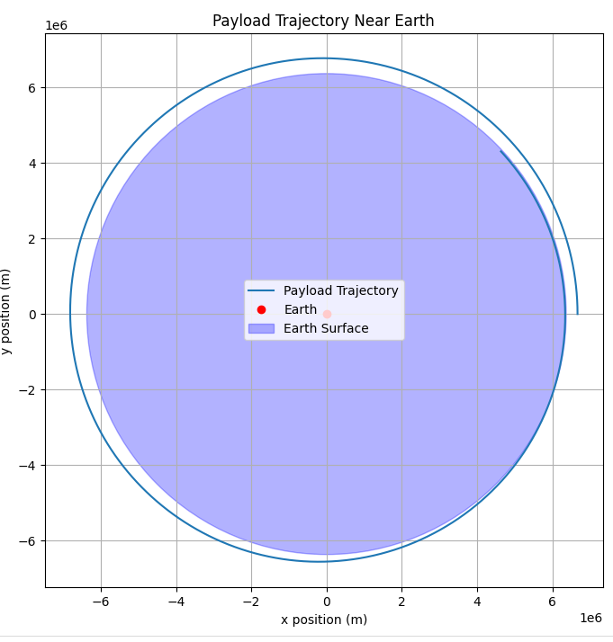

# Problem 3
### Trajectories of a Freely Released Payload Near Earth

#### Motivation:
When an object is released from a moving rocket near Earth, its trajectory depends on initial conditions and gravitational forces. This scenario presents a rich problem, blending principles of orbital mechanics and numerical methods. Understanding the potential trajectories is vital for space missions, such as deploying payloads or returning objects to Earth.

#### Task:
- Analyze the possible trajectories (e.g., parabolic, hyperbolic, elliptical) of a payload released near Earth.
- Perform a numerical analysis to compute the path of the payload based on given initial conditions (position, velocity, and altitude).
- Discuss how these trajectories relate to orbital insertion, reentry, or escape scenarios.
- Develop a computational tool to simulate and visualize the motion of the payload under Earth's gravity, accounting for initial velocities and directions.

### Mathematical Formulation

The motion of the payload is governed by Newton's law of universal gravitation:
$$ \mathbf{F} = -\frac{GMm}{r^2} \hat{r} $$

This results in the following equations of motion:
$$ \frac{d^2 x}{dt^2} = -\frac{GM}{r^3} x $$
$$ \frac{d^2 y}{dt^2} = -\frac{GM}{r^3} y $$

Where:
- $G$ is the gravitational constant ($6.67430 \times 10^{-11} \ m^3 kg^{-1} s^{-2}$)
- $M$ is Earth's mass ($5.972 \times 10^{24} \ kg$)
- $r = \sqrt{x^2 + y^2}$ is the radial distance from Earth's center
- $(x, y)$ are the coordinates of the payload

### Python Code for Simulation

```python
import numpy as np
import matplotlib.pyplot as plt
from scipy.integrate import solve_ivp

# Constants
G = 6.67430e-11  # Gravitational constant (m^3 kg^-1 s^-2)
M = 5.972e24  # Mass of Earth (kg)
R_earth = 6.371e6  # Radius of Earth (m)

# Equations of motion
def equations(t, state):
    x, y, vx, vy = state
    r = np.sqrt(x**2 + y**2)
    ax = -G * M * x / r**3
    ay = -G * M * y / r**3
    return [vx, vy, ax, ay]

# Initial conditions (altitude = 300 km, velocity = 7800 m/s tangentially)
altitude = 300e3
x0, y0 = R_earth + altitude, 0
vx0, vy0 = 0, 7800  # m/s
initial_state = [x0, y0, vx0, vy0]

# Time span for simulation
time_span = (0, 6000)  # 6000 seconds

time_eval = np.linspace(*time_span, 1000)
sol = solve_ivp(equations, time_span, initial_state, t_eval=time_eval, method='RK45')

# Extract results
x_vals, y_vals = sol.y[0], sol.y[1]

# Plot the trajectory
plt.figure(figsize=(8, 8))
plt.plot(x_vals, y_vals, label="Payload Trajectory")
plt.plot(0, 0, 'ro', label="Earth")

# Draw Earth
earth_circle = plt.Circle((0, 0), R_earth, color='b', alpha=0.3, label="Earth Surface")
plt.gca().add_patch(earth_circle)

plt.xlabel("x position (m)")
plt.ylabel("y position (m)")
plt.title("Payload Trajectory Near Earth")
plt.legend()
plt.axis("equal")
plt.grid()
plt.show()
