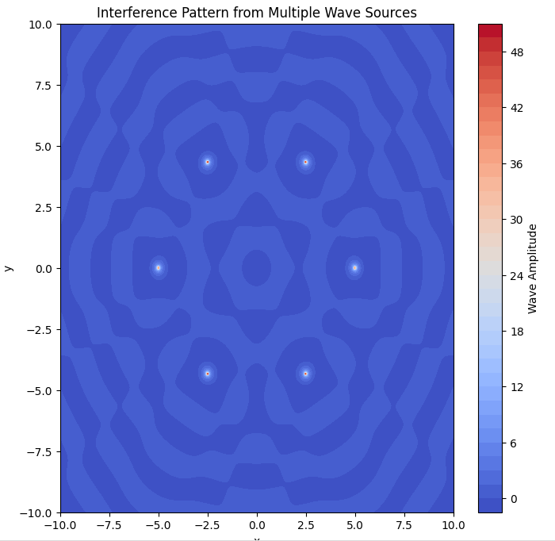

# **Interference Patterns on a Water Surface - Solutions**

## **Wave Equation**
The wave equation for an individual wave emitted from a point source at \( (x_0, y_0) \) is:

\[
\eta(x,y,t) = \frac{A}{r} \cos(k r - \omega t + \phi)
\]

where:  
- $ A $ is the amplitude of the wave,  
- $ k = \frac{2\pi}{\lambda} $ is the wave number,  
- $ \omega = 2\pi f $ is the angular frequency,  
- $ r = \sqrt{(x - x_0)^2 + (y - y_0)^2} $ is the distance from the source,  
- $ \phi $ is the initial phase.  

If multiple sources are placed at the vertices of a regular polygon, the total displacement at any point is the sum of the contributions from all sources:

\[
\eta_{tot}(x,y,t) = \sum_{n=1}^{N} \eta_n(x,y,t)
\]

where $ N $ is the number of sources.

---

## **Python Code Simulation**

The following Python code simulates the interference pattern by summing the wave equations from multiple point sources arranged in a regular polygon.

```python
import numpy as np
import matplotlib.pyplot as plt

# Define parameters
A = 1       # Amplitude
lambda_ = 2 # Wavelength
k = 2 * np.pi / lambda_  # Wave number
f = 1       # Frequency
omega = 2 * np.pi * f  # Angular frequency
N = 6       # Number of sources (hexagon)
R = 5       # Radius of polygon

def wave_source(x, y, x0, y0, t):
    r = np.sqrt((x - x0)**2 + (y - y0)**2)
    return (A / (r + 1e-6)) * np.cos(k * r - omega * t)  # Avoid division by zero

# Grid definition
x = np.linspace(-10, 10, 400)
y = np.linspace(-10, 10, 400)
X, Y = np.meshgrid(x, y)

# Define source locations
angles = np.linspace(0, 2*np.pi, N, endpoint=False)
sources = [(R * np.cos(angle), R * np.sin(angle)) for angle in angles]

def total_wave(X, Y, t):
    wave = np.zeros_like(X)
    for (x0, y0) in sources:
        wave += wave_source(X, Y, x0, y0, t)
    return wave

# Plot the interference pattern
time = 0  # Fixed time snapshot
Z = total_wave(X, Y, time)

plt.figure(figsize=(8, 8))
plt.contourf(X, Y, Z, levels=50, cmap='coolwarm')
plt.colorbar(label='Wave Amplitude')
plt.title('Interference Pattern from Multiple Wave Sources')
plt.xlabel('x')
plt.ylabel('y')
plt.show()
