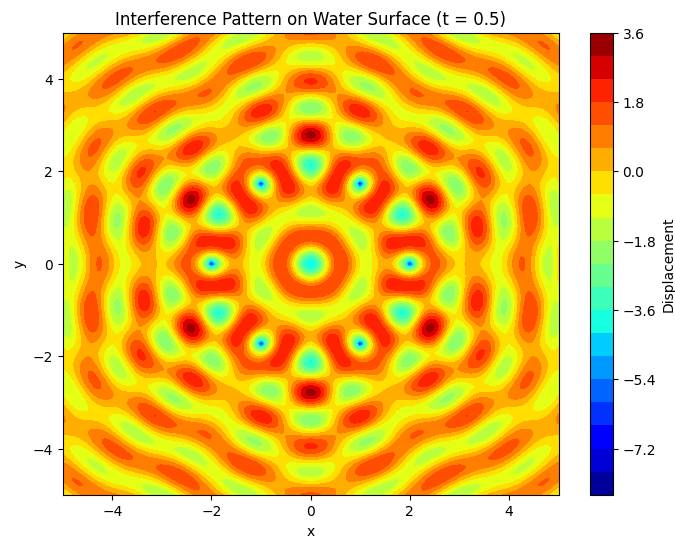

# Interference Patterns on a Water Surface

## Motivation

Interference occurs when waves from different sources overlap, creating new patterns. On a water surface, this can be easily observed when ripples from different points meet, forming distinctive interference patterns. These patterns can show us how waves combine in different ways, either reinforcing each other or canceling out. Studying these patterns helps us understand wave behavior in a simple, visual way. It also allows us to explore important concepts, like the relationship between wave phase and the effects of multiple sources. This task offers a hands-on approach to learning about wave interactions and their real-world applications, making it an interesting and engaging way to dive into wave physics.

## Problem Statement

The task is to analyze the interference patterns formed on the water surface due to the superposition of waves emitted from point sources placed at the vertices of a chosen regular polygon. The waves will be described using the Single Disturbance equation:

$$
\eta(x, y, t) = \frac{A}{\sqrt{r}} \cos(k \cdot r - \omega \cdot t + \phi)
$$

Where:

- $\eta(x, y, t)$ is the displacement of the water surface at point $(x, y)$ and time $t$.
- $A$ is the amplitude of the wave.
- $k = \frac{2\pi}{\lambda}$ is the wave number ($\lambda$ is the wavelength).
- $\omega = 2\pi \cdot f$ is the angular frequency ($f$ is the frequency).
- $r = \sqrt{(x - x_0)^2 + (y - y_0)^2}$ is the distance from the source at $(x_0, y_0)$ to the point $(x, y)$.
- $\phi$ is the initial phase.

## Steps to Follow

### 1. Select a Regular Polygon
Choose a regular polygon, such as an equilateral triangle, square, or regular pentagon, for the placement of the point sources.

### 2. Position the Sources
Place point wave sources at the vertices of the selected polygon. For example, for an equilateral triangle, there will be three sources, one at each vertex. 

### 3. Wave Equations
Write the equations describing the waves emitted from each source, considering their respective positions.

### 4. Superposition of Waves
Apply the principle of superposition by summing the wave displacements at each point on the water surface. The displacement at any point $(x, y)$ on the surface is given by:

$$
\eta_{\text{sum}}(x, y, t) = \sum_{i=1}^{N} \eta_i(x, y, t)
$$

Where $N$ is the number of sources (vertices of the polygon).

### 5. Analyze Interference Patterns
Examine the resulting displacement $\eta_{\text{sum}}(x, y, t)$ as a function of position $(x, y)$ and time $t$. Identify regions of:
- **Constructive interference** (wave amplification)
- **Destructive interference** (wave cancellation)

### 6. Visualization
Present your findings graphically, illustrating the interference patterns for the chosen regular polygon.

Considerations:
- Assume all sources emit waves with the same amplitude $A$, wavelength $\lambda$, and frequency $f$.
- The waves are coherent (i.e., they maintain a constant phase difference).

## Python Code for Simulation

```python
import numpy as np
import matplotlib.pyplot as plt

# Constants
A = 1  # amplitude
lambda_ = 1  # wavelength
f = 1  # frequency
omega = 2 * np.pi * f  # angular frequency
k = 2 * np.pi / lambda_  # wave number
phi = 0  # initial phase

# Function to compute the wave displacement at a given point (x, y) and time t
def wave(x, y, x0, y0, t):
    r = np.sqrt((x - x0)**2 + (y - y0)**2)  # distance from the source
    return A / np.sqrt(r) * np.cos(k * r - omega * t + phi)

# Function to compute the superposition of waves from multiple sources
def superposition(x, y, sources, t):
    displacement = 0
    for (x0, y0) in sources:
        displacement += wave(x, y, x0, y0, t)
    return displacement

# Create a grid of points on the water surface
x_vals = np.linspace(-5, 5, 200)
y_vals = np.linspace(-5, 5, 200)
X, Y = np.meshgrid(x_vals, y_vals)

# Define the number of sources and their positions for a regular polygon (e.g., hexagon)
N = 6  # Number of sources (vertices of hexagon)
radius = 2  # Radius of the circle on which the sources lie
angles = np.linspace(0, 2 * np.pi, N, endpoint=False)
sources = [(radius * np.cos(angle), radius * np.sin(angle)) for angle in angles]

# Time variable for the wave motion
t = 0.5  # Arbitrary time value for visualization

# Compute the displacement on the water surface due to superposition
Z = np.vectorize(superposition)(X, Y, sources, t)

# Plot the interference pattern
plt.figure(figsize=(8, 6))
plt.contourf(X, Y, Z, 20, cmap='jet')
plt.colorbar(label='Displacement')
plt.title('Interference Pattern on Water Surface (t = 0.5)')
plt.xlabel('x')
plt.ylabel('y')
plt.show()