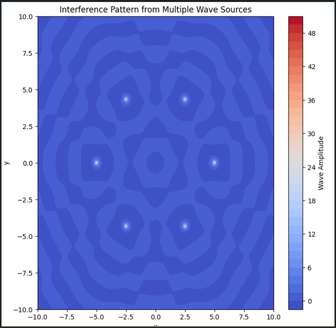

## Interference Patterns on a Water Surface

### Introduction
Interference occurs when waves from different sources overlap, forming new patterns. On a water surface, ripples from different points meet, creating interference patterns that demonstrate how waves combine, either reinforcing or canceling each other.

This project analyzes interference patterns created by multiple wave sources placed at the vertices of a regular polygon.

### Mathematical Model
A single circular wave from a point source at \((x_0, y_0)\) is given by:

$$
\eta(x, y, t) = \frac{A}{r} \cos(kr - \omega t + \phi)
$$

where:
- \(A\) is the amplitude,
- \(k = \frac{2\pi}{\lambda}\) is the wave number,
- \(\omega = 2\pi f\) is the angular frequency,
- \(r = \sqrt{(x - x_0)^2 + (y - y_0)^2}\) is the distance from the source,
- \(\phi\) is the initial phase.

For multiple sources at the vertices of a regular polygon, the total displacement is:

$$
\eta_{sum}(x, y, t) = \sum_{i=1}^{N} \eta_i(x, y, t)
$$

where \(N\) is the number of sources.

### Python Implementation

The following Python script simulates the interference pattern for a chosen regular polygon:

```python
import numpy as np
import matplotlib.pyplot as plt
from scipy.constants import pi

def wave_interference(num_sources=3, A=1, wavelength=1, frequency=1, grid_size=200, t=0):
    # Define wave parameters
    k = 2 * pi / wavelength
    omega = 2 * pi * frequency
    
    # Create a grid
    x = np.linspace(-2, 2, grid_size)
    y = np.linspace(-2, 2, grid_size)
    X, Y = np.meshgrid(x, y)
    
    # Compute positions of sources in a regular polygon
    angles = np.linspace(0, 2 * pi, num_sources, endpoint=False)
    sources = np.array([(np.cos(angle), np.sin(angle)) for angle in angles])
    
    # Compute the wave superposition
    eta_sum = np.zeros_like(X)
    for (x0, y0) in sources:
        R = np.sqrt((X - x0) ** 2 + (Y - y0) ** 2)
        eta_sum += (A / (R + 1e-6)) * np.cos(k * R - omega * t)  # Avoid division by zero
    
    # Plot the interference pattern
    plt.figure(figsize=(8, 6))
    plt.imshow(eta_sum, extent=[-2, 2, -2, 2], cmap='viridis')
    plt.colorbar(label='Wave Amplitude')
    plt.title(f'Wave Interference Pattern ({num_sources}-sided polygon)')
    plt.xlabel('X-axis')
    plt.ylabel('Y-axis')
    plt.show()

# Example usage for a pentagon
wave_interference(num_sources=5, wavelength=0.5, frequency=2)
```

### Analysis and Observations
- **Constructive Interference:** Bright regions correspond to wave peaks reinforcing each other.
- **Destructive Interference:** Dark regions indicate wave cancellation.
- **Polygon Shape Influence:** The number of sources affects the symmetry of the pattern.

### Conclusion
This simulation provides insights into wave interference, helping us visualize wave superposition and the effects of multiple sources in an intuitive manner.