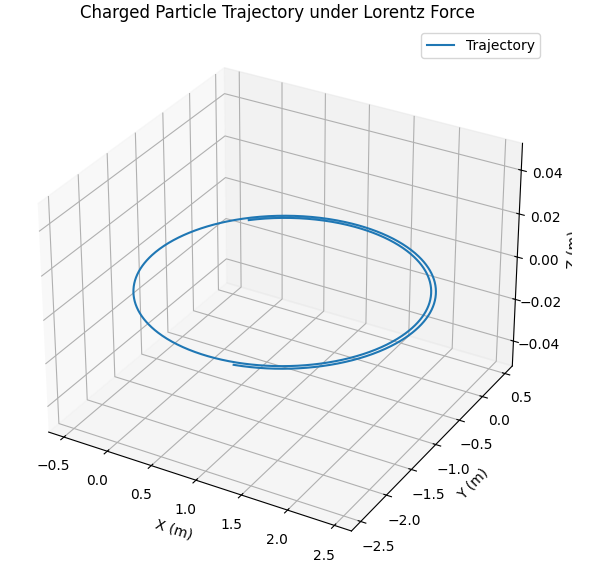

# Problem 1
# 📘 Simulating the Effects of the Lorentz Force

## 🎯 Objective

To simulate the trajectory of a charged particle under the influence of electric and magnetic fields using the Lorentz force:

$$
\vec{F} = q(\vec{E} + \vec{v} \times \vec{B})
$$

Where:

- $\vec{F}$ is the Lorentz force
- $q$ is the charge of the particle
- $\vec{E}$ is the electric field
- $\vec{v}$ is the velocity of the particle
- $\vec{B}$ is the magnetic field

---

## 🧪 Simulation Scenarios

1. **Magnetic field only** ($\vec{E} = 0$)
2. **Combined electric and magnetic fields**
3. **Crossed electric and magnetic fields**

---

## ⚙️ Parameters

- Particle charge: $q = 1.0\,\mathrm{C}$
- Particle mass: $m = 1.0\,\mathrm{kg}$
- Initial position: $\vec{r}_0 = (0, 0, 0)$
- Initial velocity: $\vec{v}_0 = (1, 1, 0)$
- Magnetic field: $\vec{B} = (0, 0, 1)\,\mathrm{T}$
- Electric field: configurable

---

## 📈 Deliverables

- Plot of particle trajectory in 3D
- Visual exploration of how $\vec{E}$, $\vec{B}$, $q$, $m$, and $\vec{v}_0$ affect motion
- Discussion on physical phenomena (Larmor radius, drift velocity)

---

## 🧠 Methods

- Euler’s method for numerical integration
- 3D plotting using `matplotlib`

---

## 🐍 Python Code

```python
import numpy as np
import matplotlib.pyplot as plt
from mpl_toolkits.mplot3d import Axes3D

# Constants
q = 1.0  # charge in Coulombs
m = 1.0  # mass in kilograms

# Fields
E = np.array([0.0, 0.0, 0.0])       # Electric field vector (V/m)
B = np.array([0.0, 0.0, 1.0])       # Magnetic field vector (T)

# Initial conditions
r = np.array([0.0, 0.0, 0.0])       # Initial position (m)
v = np.array([1.0, 1.0, 0.0])       # Initial velocity (m/s)

# Time parameters
dt = 0.01        # time step (s)
steps = 1000     # total steps

# Initialize array to store trajectory
trajectory = np.zeros((steps, 3))

# Euler integration loop
for i in range(steps):
    trajectory[i] = r
    F = q * (E + np.cross(v, B))  # Lorentz force
    a = F / m                     # Acceleration
    v += a * dt                  # Update velocity
    r += v * dt                  # Update position

# Plotting
fig = plt.figure(figsize=(10, 7))
ax = fig.add_subplot(111, projection='3d')
ax.plot(trajectory[:, 0], trajectory[:, 1], trajectory[:, 2], label='Trajectory')
ax.set_xlabel('X (m)')
ax.set_ylabel('Y (m)')
ax.set_zlabel('Z (m)')
ax.set_title('Charged Particle Trajectory under Lorentz Force')
ax.legend()
plt.show()
```

---

## 🔄 Extensions

- Replace Euler method with **Runge-Kutta** for better accuracy
- Simulate **non-uniform** fields
- Include **relativistic** corrections at high speeds

