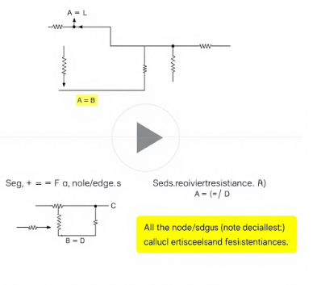

# Problem 1: Equivalent Resistance Using Graph Theory

## Solution Option 1: Algorithm Description

### Algorithm Overview
The algorithm for calculating equivalent resistance using graph theory involves iteratively simplifying the circuit graph by identifying and reducing series and parallel connections until only a single equivalent resistance remains.

### Key Steps:
1. **Graph Representation**:
   - Represent the circuit as an undirected weighted graph $G = (V, E)$ where:
     - $V$ = set of nodes (connection points/junctions)
     - $E$ = set of edges (resistors) with weight $R_i$ (resistance value)

2. **Series Reduction**:
   - Identify nodes with degree 2 (connected to exactly two edges)
   - For such nodes, combine the two resistors in series:
     $$R_{eq} = R_1 + R_2$$
   - Remove the intermediate node and replace with a single edge

3. **Parallel Reduction**:
   - Identify edges that form parallel connections (multiple edges between same pair of nodes)
   - Combine parallel resistors using:
     $$\frac{1}{R_{eq}} = \sum_{i=1}^n \frac{1}{R_i}$$
   - Replace parallel edges with a single equivalent edge

4. **Iterative Simplification**:
   - Repeat series and parallel reductions until:
     - Only two nodes remain (source and destination), or
     - No more reductions are possible (complex circuit requiring advanced methods)

### Pseudocode
    # Parallel reduction
    for u, v in graph.edges:
        parallel_edges = get_all_edges_between(u, v)
        if count(parallel_edges) > 1:
            inverse_sum = sum(1/R for R in parallel_edges)
            Req = 1 / inverse_sum
            graph.remove_all_edges_between(u, v)
            graph.add_edge(u, v, Req)

if graph has only source and target:
    return get_edge_resistance(source, target)
else:
    return "Circuit too complex for simple reduction"
    
## Solution Option 2: Python Implementation


```python
import networkx as nx

def equivalent_resistance(graph, source, target):
    """Calculate equivalent resistance between source and target nodes."""
    G = graph.copy()
    
    while True:
        # Check if we're done
        if G.number_of_nodes() == 2 and G.number_of_edges() == 1:
            return next(G.edges(data=True))[2]['weight']
        
        # Series reduction
        reduced = False
        for node in list(G.nodes()):
            if node not in [source, target] and G.degree(node) == 2:
                neighbors = list(G.neighbors(node))
                R1 = G[node][neighbors[0]]['weight']
                R2 = G[node][neighbors[1]]['weight']
                Req = R1 + R2
                G.remove_node(node)
                G.add_edge(neighbors[0], neighbors[1], weight=Req)
                reduced = True
                break
        
        if reduced:
            continue
            
        # Parallel reduction
        for u, v in list(G.edges()):
            parallel_edges = list(G.get_edge_data(u, v).values())
            if len(parallel_edges) > 1:
                inverse_sum = sum(1/e['weight'] for e in parallel_edges)
                Req = 1 / inverse_sum
                G.remove_edges_between(u, v)
                G.add_edge(u, v, weight=Req)
                reduced = True
                break
        
        if not reduced:
            break
    
    if G.number_of_nodes() == 2 and G.number_of_edges() == 1:
        return next(G.edges(data=True))[2]['weight']
    else:
        raise ValueError("Circuit too complex for simple reduction")

# Example usage
if __name__ == "__main__":
    # Example 1: Simple series circuit
    G1 = nx.Graph()
    G1.add_edge('A', 'B', weight=2)
    G1.add_edge('B', 'C', weight=3)
    print("Example 1 (2+3 series):", equivalent_resistance(G1, 'A', 'C'))
    
    # Example 2: Simple parallel circuit
    G2 = nx.Graph()
    G2.add_edge('A', 'B', weight=4)
    G2.add_edge('A', 'B', weight=4)
    print("Example 2 (4||4 parallel):", equivalent_resistance(G2, 'A', 'B'))
    
    # Example 3: Combined series-parallel
    G3 = nx.Graph()
    G3.add_edge('A', 'B', weight=1)
    G3.add_edge('B', 'C', weight=2)
    G3.add_edge('B', 'C', weight=2)
    G3.add_edge('C', 'D', weight=1)
    print("Example 3 (Combined):", equivalent_resistance(G3, 'A', 'D'))