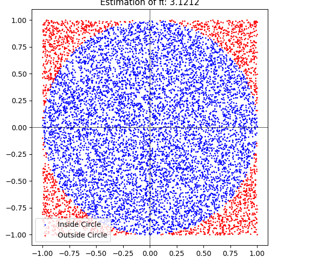

# Problem 2
# Estimating π Using Monte Carlo Methods

This document explains two methods for estimating π using Monte Carlo simulations: (1) Circle-based method, and (2) Buffon's Needle method. It includes theoretical foundations, Python code implementations, visualizations, and analysis.

---

## Part 1: Estimating π Using a Circle

### 1. Theoretical Foundation

The method relies on the geometric relationship between a circle inscribed in a square. For a unit circle (radius = 1), the area of the circle is $ \pi r^2 = \pi \cdot 1^2 = \pi $, and the area of the square that bounds it is $ 4 \cdot 1^2 = 4 $. The ratio of the areas is therefore:

$$
\frac{\text{Area of Circle}}{\text{Area of Square}} = \frac{\pi}{4}
$$

By generating random points uniformly within the square, the proportion of points that fall inside the circle approximates this ratio. Thus, we can estimate π as:

$$
\pi \approx 4 \cdot \frac{\text{Number of Points Inside Circle}}{\text{Total Number of Points}}
$$

#### Derivation for a Unit Circle:
- A point $(x, y)$ lies inside the unit circle if $ x^2 + y^2 \leq 1 $.
- The square has vertices at $(-1, -1)$, $(-1, 1)$, $(1, -1)$, and $(1, 1)$.

### 2. Simulation

Below is the Python implementation for the circle-based Monte Carlo simulation.

```python
import numpy as np
import matplotlib.pyplot as plt

def estimate_pi(num_points):
    # Generate random points in the square [-1, 1] x [-1, 1]
    points = np.random.uniform(-1, 1, (num_points, 2))
    
    # Determine which points fall inside the unit circle
    distances = np.linalg.norm(points, axis=1)
    inside_circle = distances <= 1
    
    # Estimate pi
    pi_estimate = 4 * np.mean(inside_circle)
    
    # Visualization
    plt.figure(figsize=(6, 6))
    plt.scatter(points[inside_circle, 0], points[inside_circle, 1], color='blue', s=1, label='Inside Circle')
    plt.scatter(points[~inside_circle, 0], points[~inside_circle, 1], color='red', s=1, label='Outside Circle')
    plt.axhline(0, color='black', linewidth=0.5)
    plt.axvline(0, color='black', linewidth=0.5)
    plt.gca().set_aspect('equal', adjustable='box')
    plt.title(f'Estimation of π: {pi_estimate:.4f}')
    plt.legend()
    plt.show()
    
    return pi_estimate

# Run the simulation with 10,000 points
estimate_pi(10000)