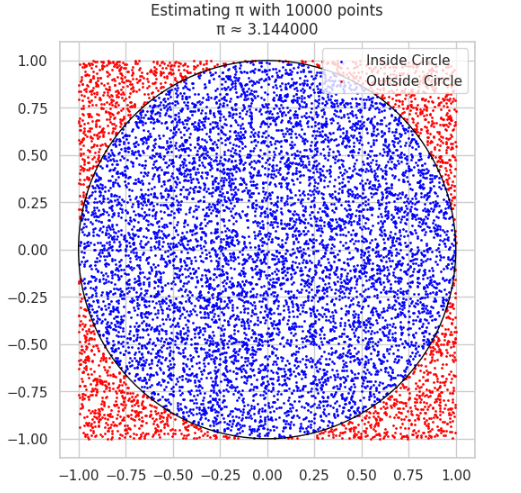

# Estimating $\pi$ Using Monte Carlo Methods

## Introduction

Monte Carlo methods use randomness to solve problems that may be deterministic in theory. A classic example is estimating the value of $\pi$ using either geometric probability (random points in a square) or Buffon's Needle experiment. Both methods demonstrate how probabilistic simulations can approximate mathematical constants.

---

## PART 1: Estimating $\pi$ Using a Circle

### Theoretical Foundation

We inscribe a unit circle (radius = 1) inside a square of side length 2 (from -1 to 1 on both axes). The area of the circle is:

$$
A_{\text{circle}} = \pi r^2 = \pi
$$

The area of the square is:

$$
A_{\text{square}} = (2)^2 = 4
$$

If we randomly generate points within the square, the proportion that falls inside the circle approximates the ratio of the areas:

$$
\frac{\text{points in circle}}{\text{total points}} \approx \frac{\pi}{4}
$$

Thus, we estimate:

$$
\pi \approx 4 \times \frac{\text{points in circle}}{\text{total points}}
$$

### Python Simulation

```python
import numpy as np
import matplotlib.pyplot as plt

def estimate_pi_circle(n_points):
    x = np.random.uniform(-1, 1, n_points)
    y = np.random.uniform(-1, 1, n_points)
    inside_circle = x**2 + y**2 <= 1
    pi_estimate = 4 * np.sum(inside_circle) / n_points

    # Visualization
    plt.figure(figsize=(6,6))
    plt.scatter(x[inside_circle], y[inside_circle], s=1, color='blue', label='Inside Circle')
    plt.scatter(x[~inside_circle], y[~inside_circle], s=1, color='red', label='Outside Circle')
    circle = plt.Circle((0, 0), 1, color='black', fill=False)
    plt.gca().add_patch(circle)
    plt.gca().set_aspect('equal')
    plt.title(f'Estimating π with {n_points} points\nπ ≈ {pi_estimate:.6f}')
    plt.grid(True)
    plt.legend()
    plt.show()
