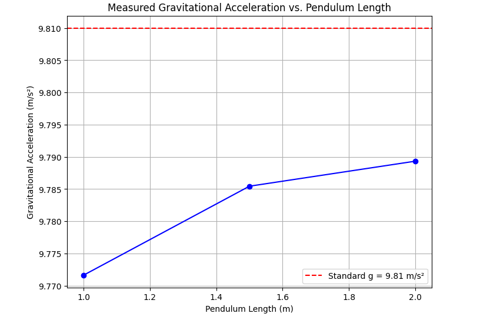

# Problem 1
# Measuring Earth's Gravitational Acceleration Using a Pendulum

## Motivation:
The acceleration due to gravity ($ g $) is a fundamental constant that influences a wide range of physical phenomena. Measuring $ g $ accurately is crucial for understanding gravitational fields, conducting experiments in various fields, and analyzing local gravitational variations.

This problem involves measuring $ g $ using the oscillations of a simple pendulum, where the period of oscillation depends on the local gravitational field. The exercise emphasizes rigorous measurement practices, uncertainty analysis, and their role in experimental physics.

---

## Task:
Measure the acceleration due to gravity ($ g $) using a pendulum and analyze the uncertainties in the measurements.

---

## Materials:
- A string (1 or 2 meters long)
- A small, dense object (e.g., a metal ball)
- Stopwatch
- Ruler or measuring tape
- Support stand (to suspend the pendulum)

---

## Procedure:

1. **Setup the Pendulum:**
   - Attach the string to the support stand and suspend the small object to create a pendulum.
   - Ensure the pendulum can swing freely without obstruction.

2. **Adjust the Length:**
   - Measure and record the length $ L $ of the pendulum (from the pivot point to the center of mass of the object).

3. **Measure the Period:**
   - Displace the pendulum slightly (less than $ 10^\circ $) from its equilibrium position and release it.
   - Use the stopwatch to measure the time for 10 complete oscillations.
   - Repeat this measurement at least three times to ensure accuracy.

4. **Calculate the Period:**
   - Compute the average time for 10 oscillations and divide by 10 to find the period $ T $.

5. **Repeat for Different Lengths:**
   - Change the length of the pendulum and repeat the measurements for at least three different lengths.

---

## Theoretical Foundation:

The period $ T $ of a simple pendulum for small angular displacements is given by:

$$
T = 2\pi \sqrt{\frac{L}{g}}
$$

Rearranging for $ g $, we get:

$$
g = \frac{4\pi^2 L}{T^2}
$$

Where:
- $ L $ is the length of the pendulum,
- $ T $ is the period of oscillation,
- $ g $ is the gravitational acceleration.

---

## Python Code Implementation:

Below is the Python code to calculate $ g $ based on measured data and visualize the results.

```python
import numpy as np
import matplotlib.pyplot as plt

# Function to calculate g from pendulum data
def calculate_gravity(lengths, periods):
    """
    Calculate gravitational acceleration g using the formula:
    g = 4 * pi^2 * L / T^2
    """
    g_values = []
    for L, T in zip(lengths, periods):
        g = (4 * np.pi**2 * L) / T**2
        g_values.append(g)
    return g_values

# Example data: lengths (in meters) and periods (in seconds)
lengths = [1.0, 1.5, 2.0]  # Replace with your measured lengths
periods = [2.01, 2.46, 2.84]  # Replace with your measured periods

# Calculate g for each length
g_values = calculate_gravity(lengths, periods)

# Print results
print("Gravitational Acceleration (g) Values:")
for i, g in enumerate(g_values):
    print(f"Length {lengths[i]} m: g = {g:.3f} m/s^2")

# Average g value
average_g = np.mean(g_values)
print(f"\nAverage Gravitational Acceleration (g): {average_g:.3f} m/s^2")

# Plotting
plt.figure(figsize=(8, 6))
plt.plot(lengths, g_values, marker='o', linestyle='-', color='blue')
plt.axhline(y=9.81, color='red', linestyle='--', label='Standard g = 9.81 m/s²')
plt.title('Measured Gravitational Acceleration vs. Pendulum Length')
plt.xlabel('Pendulum Length (m)')
plt.ylabel('Gravitational Acceleration (m/s²)')
plt.legend()
plt.grid(True)
plt.show()
