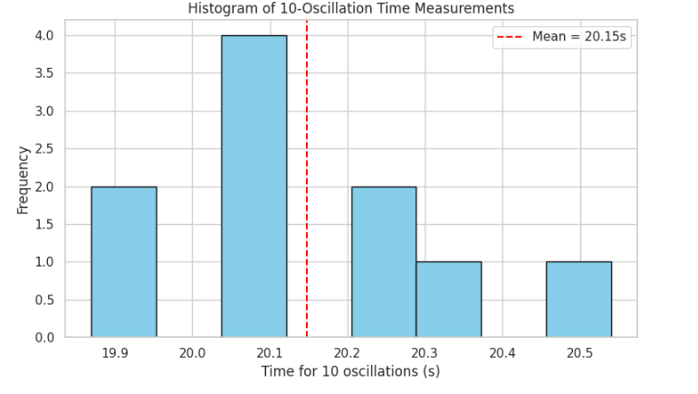

# Problem 1: Measuring Earth's Gravitational Acceleration with a Pendulum

## 🔬 Motivation

The acceleration due to gravity, $g$, is a fundamental constant that influences a wide range of physical phenomena. Measuring $g$ is crucial for understanding gravitational interactions, designing structures, and conducting experiments in various fields. A simple pendulum provides a classical method for determining $g$, as its period depends on the local gravitational field.

---

## 🎯 Task

Measure the acceleration due to gravity ($g$) using a pendulum and analyze the uncertainties in the measurement.

---

## 🧪 Procedure

### Materials

- A string (~1 to 1.5 meters long)
- A small weight (e.g., a metal bob, coin, bag of sugar, key chain)
- Stopwatch (or smartphone timer)
- Ruler or measuring tape

### Steps

1. Attach the weight to the string and fix the other end to a sturdy support.
2. Measure the length of the pendulum, $L$, from the suspension point to the center of the weight using a ruler or measuring tape.
   - Record the **resolution** of the measuring tool.
   - Calculate the uncertainty in length:  
     $$
     \Delta L = \frac{\text{Ruler Resolution}}{2}
     $$
3. Displace the pendulum slightly (~15°) and release it.
4. Measure the time for **10 full oscillations** ($T_{10}$). Repeat this 10 times and record all values.
5. Calculate the mean time for 10 oscillations, $\overline{T_{10}}$, and the standard deviation, $\sigma_{T_{10}}$.
6. Determine the uncertainty in the mean time:
   $$
   \Delta \overline{T_{10}} = \frac{\sigma_{T_{10}}}{\sqrt{n}}
   $$
   where $n = 10$.

---

## 🧮 Calculations

### 1. Calculate the Period

- Period of one oscillation:
  $$
  T = \frac{\overline{T_{10}}}{10}
  $$
- Uncertainty in $T$:
  $$
  \Delta T = \frac{\Delta \overline{T_{10}}}{10}
  $$

### 2. Determine $g$

Use the formula for the period of a simple pendulum:
$$
T = 2\pi \sqrt{\frac{L}{g}} \Rightarrow g = \frac{4\pi^2 L}{T^2}
$$

### 3. Propagate Uncertainties

Uncertainty in $g$:
$$
\Delta g = g \sqrt{\left( \frac{\Delta L}{L} \right)^2 + \left( 2 \cdot \frac{\Delta T}{T} \right)^2}
$$

---

## 📊 Analysis

1. **Compare** your measured $g$ with the standard value:
   - $g \approx 9.81 \, \text{m/s}^2$

2. **Discuss:**
   - The effect of instrument resolution on $\Delta L$
   - Variability in timing and its impact on $\Delta T$
   - Any assumptions or experimental limitations

---

## 📝 Deliverables

1. Tabulated data:
   - $L$, $\Delta L$, $\overline{T_{10}}$, $\sigma_{T_{10}}$, $\Delta \overline{T_{10}}$, $T$, $\Delta T$
2. Calculated $g$ and $\Delta g$
3. Discussion of sources of uncertainty and their impact

 Python simulation
  